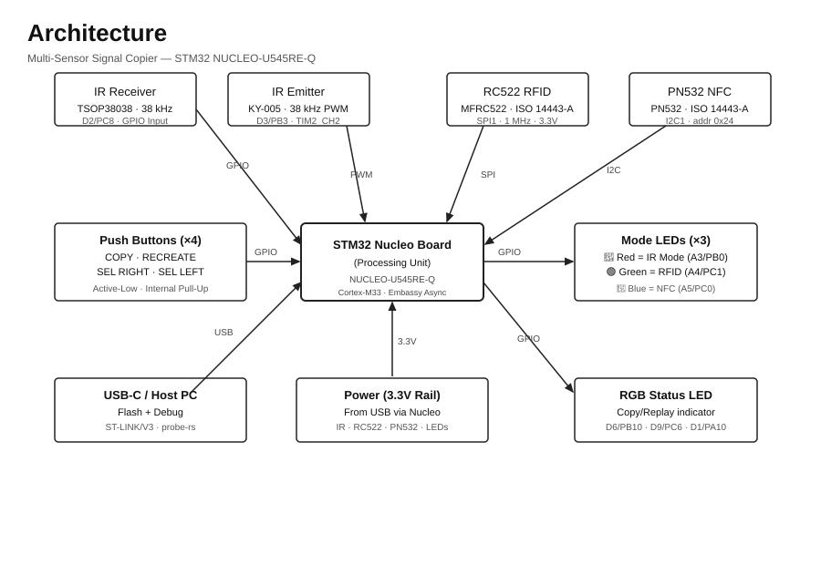

# Multi-Sensor Signal Copier & Replayer

A universal signal capture and replay system that records IR, RFID, and NFC signals using an STM32 microcontroller and replays them on demand.

:::info

**Author**: Ionuț Păiușan \
**GitHub Project Link**: [pm-lab-project](https://github.com/UPB-PMRust-Students/acs-project-2026-ServiceWare20)

:::

<!-- do not delete the \ after your name -->

## Description

A multi-sensor signal copier built around the STM32 NUCLEO-U545RE-Q board. The system can capture signals from three different sensor subsystems — an IR receiver (38 kHz), an RFID reader (RC522 over SPI), and an NFC module (PN532 over I2C) — store the captured signal in memory, and replay it through the corresponding emitter or writer. The active sensor mode is indicated by a dedicated LED (Red = IR, Green = RFID, Blue = NFC), and a separate RGB LED shows the copy/replay status. Four push-buttons control all operations: COPY, RECREATE, SELECT RIGHT, and SELECT LEFT.

## Motivation

Working with wireless and contactless communication protocols is something I wanted to explore in a practical, hands-on context. This project forced me to interface with three distinct hardware communication buses (GPIO/PWM, SPI, I2C) simultaneously, implement debouncing and interrupt-driven input, and manage real-time signal timing. It also gave me the opportunity to write embedded Rust using the Embassy async framework and to understand how consumer electronics protocols like IR remotes and contactless cards actually work under the hood.

## Architecture

The system is organized around a central state machine running on the STM32U545RE-Q. Three sensor subsystems connect over different buses:

- **IR subsystem**: TSOP38038 receiver on GPIO (D2/PC8) captures demodulated 38 kHz pulses; KY-005 emitter driven by TIM2_CH2 PWM on D3/PB3 replays signals.
- **RFID subsystem**: MFRC522 (RC522) module connected over SPI1 (D13/D11/D12/D5/D7) reads and writes ISO 14443-A cards.
- **NFC subsystem**: PN532 module connected over I2C1 (D14/D15) with I2C address 0x24; mode switches set to I2C (SEL0=1, SEL1=0).
- **User interface**: 4 push-buttons (active-low) + 3 mode LEDs + 1 RGB status LED.

## Log

<!-- write your progress here every week -->

### Week 5 - 11 April

Initial project planning. Defined the three sensor subsystems (IR, RFID, NFC) and the button/LED user interface. Selected the RC522 (SPI) and PN532 (I2C) modules as the RFID and NFC hardware respectively.

### Week 12 - 18 April

Ordered all hardware components. Set up the Embassy Rust project skeleton with correct Cargo configuration for the STM32U545RE-Q target (`thumbv8m.main-none-eabihf`). Implemented the IR subsystem: signal capture via GPIO input interrupt and replay via 38 kHz PWM on TIM2_CH2. LED indicators and button debouncing implemented.

### Week 19 - 25 April

Integrated the RC522 RFID module over SPI1. Implemented card UID reading and verified the chip version register (expect 0x91/0x92). Migrated from a custom driver to the official `mfrc522` Rust crate. Wrote the `rfid_uart_test` diagnostic binary.

### Week 26 April - 2 May

Integrated the PN532 NFC module over I2C1. Migrated to the official `pn532` Rust crate. Wrote the `pn532_test` diagnostic binary including I2C probe, firmware version query, and card UID reading. Documented full wiring and electrical schematics.

### Week 3 - 9 May

Hardware debugging: verified SPI and I2C bus signals with a logic analyzer. Confirmed RC522 SPI communication working. Ongoing troubleshooting of PN532 I2C address detection (0x24). Completed full application state machine integrating all three subsystems with mode switching via SELECT buttons.

## Hardware

The project uses an **STM32 NUCLEO-U545RE-Q** as the main microcontroller (Cortex-M33, 160 MHz). Three sensor modules are connected over different buses:

- **IR Subsystem**: TSOP38038/VS1838B IR receiver (38 kHz demodulator) + KY-005 IR emitter module. The receiver output feeds GPIO PC8 (D2); the emitter is driven by TIM2 channel 2 PWM on PB3 (D3).
- **RFID Subsystem**: MFRC522 (RC522) module communicating over SPI1 at 1 MHz. Operates at 3.3V exclusively. Reads ISO 14443-A cards (MIFARE, NTAG) at 13.56 MHz.
- **NFC Subsystem**: PN532 NFC module communicating over I2C1 (address 0x24). Mode switches set to I2C mode (SEL0=1, SEL1=0). Also reads ISO 14443-A at 13.56 MHz.
- **User Interface**: 4 momentary push-buttons (active-low, internal pull-up); 3 single-colour LEDs (Red/Green/Blue) indicating the active sensor mode; 1 common-cathode RGB LED indicating copy/replay status.
- **Power**: All modules powered from the Nucleo's 3.3V rail via USB from the host PC.

### Schematics

The complete wiring and electrical schematics are documented in `WIRING_SCHEMA.md` and `ELECTRICAL_SCHEMA.md` in the project repository.

### Bill of Materials

| Device                          | Usage                               | Price    |
| ------------------------------- | ----------------------------------- | -------- |
| STM32 NUCLEO-U545RE-Q           | Main microcontroller (Cortex-M33)   | ~120 RON |
| MFRC522 RC522 RFID Module       | RFID card read/write over SPI1      | ~12 RON  |
| PN532 NFC Module                | NFC card read/write over I2C1       | ~35 RON  |
| TSOP38038 / VS1838B IR Receiver | 38 kHz IR signal capture            | ~5 RON   |
| KY-005 IR Emitter Module        | 38 kHz IR signal replay             | ~4 RON   |
| Red LED (5mm)                   | IR mode indicator                   | ~1 RON   |
| Green LED (5mm)                 | RFID mode indicator                 | ~1 RON   |
| Blue LED (5mm)                  | NFC mode indicator                  | ~1 RON   |
| RGB LED (5mm common-cathode)    | Copy/replay status indicator        | ~2 RON   |
| 220Ω resistors ×6               | LED current limiting                | ~3 RON   |
| Momentary push-buttons ×4       | COPY, RECREATE, SEL_RIGHT, SEL_LEFT | ~4 RON   |
| Breadboard + jumper wires       | Prototyping                         | ~15 RON  |
| USB-A to Micro-B cable          | Power + ST-LINK programming         | ~10 RON  |

## Software

| Library                                                             | Description                           | Usage                             |
| ------------------------------------------------------------------- | ------------------------------------- | --------------------------------- |
| [embassy-stm32](https://github.com/embassy-rs/embassy)              | STM32 HAL for Embassy async framework | GPIO, SPI1, I2C1, TIM2 PWM, EXTI  |
| [embassy-executor](https://github.com/embassy-rs/embassy)           | Async task executor for Cortex-M      | Runs concurrent sensor tasks      |
| [embassy-time](https://github.com/embassy-rs/embassy)               | Timekeeping and async delays          | Signal timing, debounce, timeouts |
| [embassy-sync](https://github.com/embassy-rs/embassy)               | Async synchronization primitives      | Mutex for shared sensor state     |
| [mfrc522](https://crates.io/crates/mfrc522)                         | MFRC522 RFID driver (SPI)             | RC522 card UID reading            |
| [pn532](https://crates.io/crates/pn532)                             | PN532 NFC driver (I2C/SPI/UART)       | PN532 firmware query and card UID |
| [embedded-hal](https://github.com/rust-embedded/embedded-hal)       | Hardware abstraction layer traits     | Standard SPI/I2C/GPIO interfaces  |
| [embedded-hal-async](https://github.com/rust-embedded/embedded-hal) | Async HAL traits                      | Async SPI and I2C operations      |
| [defmt](https://github.com/knurling-rs/defmt)                       | Lightweight logging framework         | RTT debug output                  |
| [defmt-rtt](https://github.com/knurling-rs/defmt)                   | RTT transport for defmt               | Sends logs to probe-rs / VS Code  |
| [panic-probe](https://github.com/knurling-rs/probe-run)             | Panic handler for probe-rs            | Crash reporting over RTT          |

## Links

<!-- Add a few links that inspired you and that you think you will use for your project -->

1. [Embassy Async Framework](https://embassy.dev/) — The async Rust embedded framework used throughout the project
2. [PN532 User Manual](https://www.nxp.com/docs/en/user-guide/141520.pdf) — NXP official PN532 I2C/SPI/HSU protocol documentation
3. [MFRC522 Datasheet](https://www.nxp.com/docs/en/data-sheet/MFRC522.pdf) — RC522 SPI register map and ISO 14443-A framing
4. [IR Remote Protocols (NEC)](https://www.sbprojects.net/knowledge/ir/nec.php) — NEC protocol timing reference for IR capture/replay
5. [probe-rs](https://probe.rs/) — Embedded debugger and flashing tool used with the STM32
